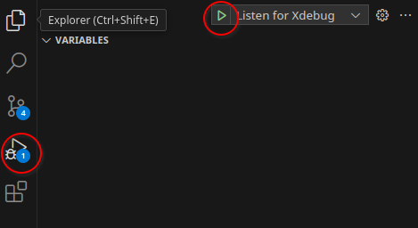
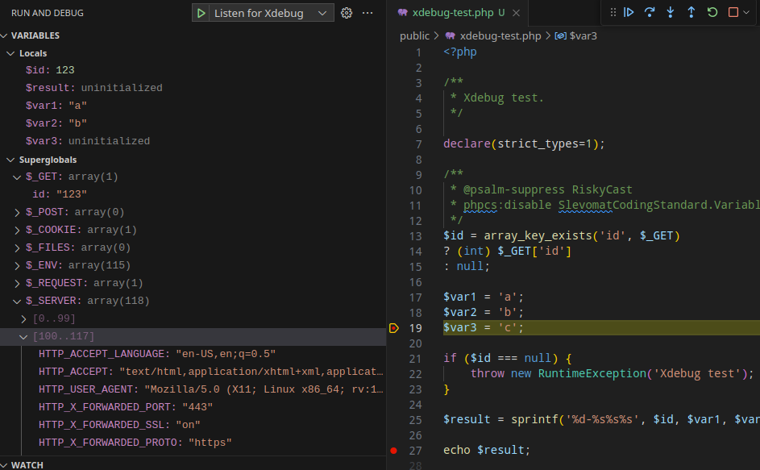

# Xdebug + DDEV + Visual Studio Code

## About

- [Xdebug - Debugger and Profiler Tool for PHP](https://xdebug.org/)

This article is about using [Step Debugging](https://xdebug.org/docs/step_debug).

> "Xdebug's step debugger allows you to interactively walk through your code to debug control flow and examine data structures."

---

## Setup: Windows WSL2

- Ubuntu/WSL: do not install anything specific, everything is handled in the DDEV container;
- vscode: Install extension: `WSL` (publisher Microsoft);
- vscode: Install extension: `PHP Debug` (publisher Xdebug);
- vscode: Install the `PHP Debug` extension also in WSL ("Install in WSL: Ubuntu");


- vscode: restart;

### If using Docker Desktop

When running vscode from Ubuntu (`code .`) xdebug can't connect to the IDE.

[Official istructions (not working)](https://github.com/ddev/ddev/issues/3781#issuecomment-1288256238).
[Documentation (not working)](https://ddev.readthedocs.io/en/latest/users/configuration/config/#xdebug_ide_location).

Working solution:

- Ubuntu/WSL: get IP: `hostname -I`
- Ubuntu/WSL: setup DDEV Xdebug IP: `ddev config global --xdebug-ide-location=__IP__`
- Ubuntu/WSL: restart DDEV: `ddev restart`

Note: do not use custom ini file as some comments suggest, as the project may be run in different environments where the setup is different.

---

## Configuration

### `.vscode/launch.json`

```json
{
    // Custom xdebug configuration for Visual Studio Code + DDEV
    "version": "0.2.0",
    "configurations": [
        {
            "name": "Listen for Xdebug",
            "type": "php",
            "request": "launch",
            "port": 9003,
            "pathMappings": {
                "/var/www/html": "${workspaceRoot}"
            }
        }
    ]
}
```

---

## Usage

Enable in DDEV (make sure project is started): `ddev xdebug on`.

Start debugging in vscode:

- Open "Run and Debug" (Ctrl+Shift+D)
- Start debugging: "Listen for Xdebug" (F5)



Test: `public/xdebug-test.php`

Add a breakpoint (click on the left of the line number) on the line with `$var3`, and another one on the line with the `echo`.


Navigate to the page `xdebug-test.php`:

- with parameter: [https://sandbox.ddev.site/xdebug-test.php?id=123](https://sandbox.ddev.site/xdebug-test.php?id=123)
- without parameter: [https://sandbox.ddev.site/xdebug-test.php](https://sandbox.ddev.site/xdebug-test.php)

Page loading is paused and the editor should now be in focus.

Go to vscode, some data should appear in the "Run and Debug" section.



Note: `$var3` is not initialized because the break happens before the line is processed.

By clicking "Continue" we can go to the next breakpoint.


Now also `$var3` has a value.

---

## Notes

- Breakpoints will be added before the next line with code (if adding on a blank line, it will be moved);
-  To debug also any errors that happen during execution (even if caught): Breakpoints > Everything.

- To stop debugging:
    - vscode: red square button (Shift+F5)
    - DDEV: `ddev xdebug off`

---

## References

- [Step Debugging with Xdebug](https://ddev.readthedocs.io/en/latest/users/debugging-profiling/step-debugging/)
- [Xdebug cases](https://drive.google.com/file/d/1_ZIg7TAxPIJvwPXNefXy9laehmIVw028/view)
- [Pseudo-hosts values for xdebug.client_host](https://docs.google.com/document/d/1W-NzNtExf5C4eOu3rRQm1WlWnbW44u3ANDDA49d3FD4/edit?pli=1#heading=h.om72lccwqcou)
