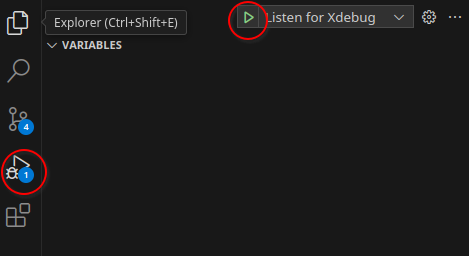

# Xdebug + ddev + Visual Studio Code

## About

- [Xdebug - Debugger and Profiler Tool for PHP](https://xdebug.org/)

This article is about using [Step Debugging](https://xdebug.org/docs/step_debug).

> "Xdebug's step debugger allows you to interactively walk through your code to debug control flow and examine data structures."

---

## Setup: Windows WSL2

- Ubuntu/WSL: do not install anything specific, everything is handled in the `ddev` container;
- vscode: Install extension: `WSL` (publisher Microsoft);
- vscode: Install extension: `PHP Debug` (publisher Xdebug);
- vscode: Install the `PHP Debug` extension also in WSL ("Install in WSL: Ubuntu");


- vscode: restart;
- Ubuntu/WSL: setup ide: `ddev config global --xdebug-ide-location=wsl2`

;

- Ubuntu/WSL: restart ddev: `ddev restart`

### Troubleshooting:

#### Check logs:

```sh
ddev logs
```

If error:

"Xdebug: [Step Debug] Time-out connecting to debugging client, waited: 200 ms. Tried: host.docker.internal:9003 (through xdebug.client_host/xdebug.client_port).'"

Make sure to perform all steps in the "Windows WSL2" section.

#### Check firewall

Turn off firewall temporarily;

#### Update ddev (and all packages)

```sh
sudo apt update
sudo apt upgrade
```

---

## Configuration

### `.vscode/launch.json`

```json
{
    // Custom xdebug configuration for Visual Studio Code + ddev
    "version": "0.2.0",
    "configurations": [
        {
            "name": "Listen for Xdebug",
            "type": "php",
            "request": "launch",
            "port": 9003,
            "pathMappings": {
                "/var/www/html": "${workspaceRoot}"
            }
        }
    ]
}
```

---

## Usage

Enable in ddev (make sure project is started): `ddev xdebug on`.

Start debugging in vscode:

- Open "Run and Debug" (Ctrl+Shift+D)
- Start debugging: "Listen for Xdebug" (F5)



Test: `public/xdebug-test.php`

Add a breakpoint (click on the left of the line number) on the line with `$var3`, and another one on the line with the `echo`.


Navigate to the page `xdebug-test.php`:

- with parameter: [https://sandbox.ddev.site/xdebug-test.php?id=123](https://sandbox.ddev.site/xdebug-test.php?id=123)
- without parameter: [https://sandbox.ddev.site/xdebug-test.php](https://sandbox.ddev.site/xdebug-test.php)

Page loading is paused and the editor should now be in focus.

Go to vscode, some data should appear in the "Run and Debug" section.


Note: `$var3` is not initialized because the break happens before the line is processed.

By clicking "Continue" we can go to the next breakpoint.


Now also `$var3` has a value.

---

## Notes

- Breakpoints will be added before the next line with code (if adding on a blank line, it will be moved);
-  To debug also any errors that happen during execution (even if caught): Breakpoints > Everything.

- To stop debugging:
    - vscode: red square button (Shift+F5)
    - ddev: `ddev xdebug off`

---

## References

- [Step Debugging with Xdebug](https://ddev.readthedocs.io/en/latest/users/debugging-profiling/step-debugging/)
